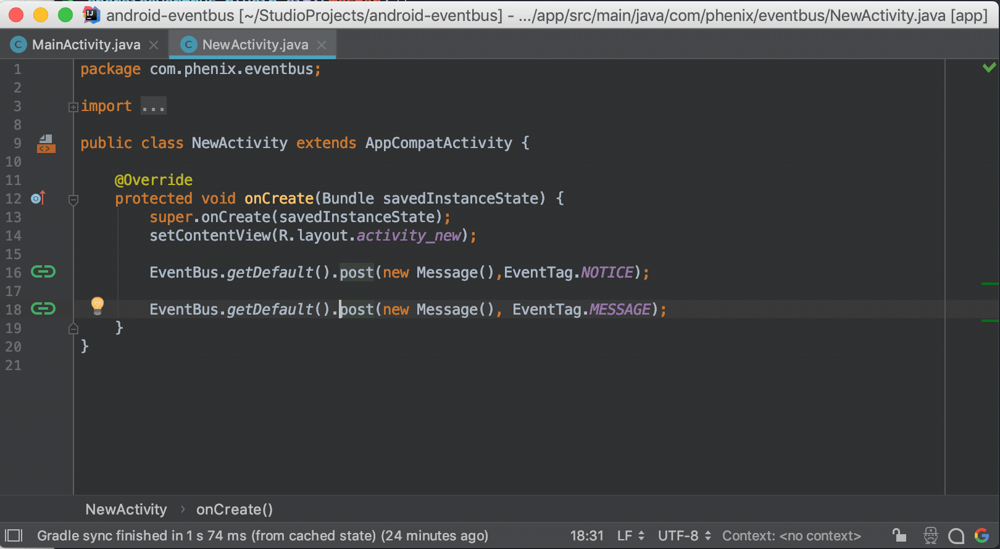

# androideventbus-plugin
[](https://travis-ci.org/iplanetcn/androideventbus-plugin)

> Android Studio 



### 🔨为 AndroidEventBus 提供快速索引和跳转（目前只支持 AndroidEventBus 1.x 版本）:
    
- 从 `EventBus.post(Message, TAG)` 到 `@Subscribe`
- 从 `@Subscribe` 到 `EventBus.post(Message, TAG)`
  
### 🚀安装方式

- Preference -> Plugins -> Browse `AndroidEventBus` -> Select `AndroidEventBus Plugin` -> push Install plugin Btn.

- [Download](https://github.com/iplanetcn/androideventbus-plugin/raw/master/androideventbus-plugin.jar) the plugin jar and select "Install Plugin From Disk" in Android Studio's plugin preferences.

### ⚠️警告
目前org.simple:androideventbus库（目前最新版1.0.5.1）已经停止维护，建议更换为[https://github.com/greenrobot/EventBus](https://github.com/greenrobot/EventBus)。

### 说明
该插件参考了eventbus3-intellij-plugin的源码，并进行了修改和代码优化。

### License
```
Copyright [2018] [iplanetcn]

Licensed under the Apache License, Version 2.0 (the "License");
you may not use this file except in compliance with the License.
You may obtain a copy of the License at

    http://www.apache.org/licenses/LICENSE-2.0

Unless required by applicable law or agreed to in writing, software
distributed under the License is distributed on an "AS IS" BASIS,
WITHOUT WARRANTIES OR CONDITIONS OF ANY KIND, either express or implied.
See the License for the specific language governing permissions and
limitations under the License.
```
